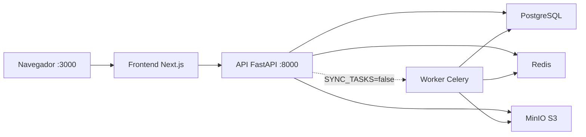

# CV ATS Scanner

Herramienta SaaS para analizar la compatibilidad ATS entre tu CV y una oferta de empleo concreta.

## Stack

- **Frontend**: Next.js (App Router), TypeScript, Tailwind CSS, shadcn/ui
- **Backend**: Python, FastAPI, SQLAlchemy 2.0, Alembic, Celery
- **Infra**: PostgreSQL + pgvector, Redis, MinIO

## Requisitos previos

| Herramienta | Versión | Para qué |
|-------------|---------|----------|
| Docker & Docker Compose | cualquiera reciente | Base de datos, Redis y almacenamiento de archivos |
| Node.js | 20+ | Frontend (modo local) |
| pnpm | 9+ | Gestor de paquetes del frontend |
| Python | 3.12+ | Backend (modo local) |

## Cómo funciona el proyecto

La app tiene cuatro piezas que deben estar en marcha:



| Servicio | Puerto | Rol |
|----------|--------|-----|
| Frontend | 3000 | Interfaz web |
| API (backend) | 8000 | Lógica de negocio y autenticación |
| PostgreSQL | 5432 | Datos y vectores |
| Redis | 6379 | Cola de tareas (Celery) |
| MinIO | 9000 / 9001 | Almacenamiento de CVs (API / consola) |

### Tareas en segundo plano (`SYNC_TASKS`)

En `.env`, la variable `SYNC_TASKS` controla cómo se procesan los CVs:

| Valor | Comportamiento | Qué necesitas levantar |
|-------|----------------|------------------------|
| `true` *(por defecto en dev)* | El backend procesa todo al instante, sin cola | Solo infra + backend |
| `false` | Las tareas van a Celery vía Redis | Infra + backend + **worker** |

Para desarrollo local, deja `SYNC_TASKS=true` y no necesitas el worker.

---

## Opción A — Desarrollo local (recomendado)

Infraestructura en Docker; backend y frontend en tu máquina. Es la forma más cómoda para iterar con hot-reload.

### 1. Configurar entorno

Desde la raíz del repositorio:

```bash
cp .env.example .env
```

El `.env.example` ya trae valores válidos para desarrollo. No hace falta editarlo para arrancar.

### 2. Levantar infraestructura

```bash
docker compose up -d postgres redis minio minio-init
```

Comprueba que todo está bien:

```bash
docker compose ps
```

| Contenedor | Estado esperado |
|------------|-----------------|
| `cvats-postgres`, `cvats-redis`, `cvats-minio` | `Up` |
| `cvats-minio-init` | `Exited (0)` — normal; crea el bucket y termina |

### 3. Arrancar el backend

En una terminal:

```bash
cd backend
python -m venv .venv
source .venv/bin/activate   # Windows: .venv\Scripts\activate
pip install -e ".[dev]"
alembic upgrade head
uvicorn app.main:app --reload
```

La API queda en http://localhost:8000 (docs en http://localhost:8000/docs).

### 4. Arrancar el frontend

En **otra** terminal:

```bash
cd frontend
pnpm install
pnpm dev
```

La app queda en http://localhost:3000.

### Resumen rápido (3 terminales)

```bash
# Terminal 1 — infra
docker compose up -d postgres redis minio minio-init

# Terminal 2 — backend
cd backend && source .venv/bin/activate && uvicorn app.main:app --reload

# Terminal 3 — frontend
cd frontend && pnpm dev
```

---

## Opción B — Todo con Docker

Útil si prefieres no instalar Python ni Node en tu máquina. El backend corre en contenedor; el frontend solo si activas el perfil `full`.

### 1. Configurar entorno

```bash
cp .env.example .env
```

### 2. Infra + API

```bash
docker compose build backend
docker compose up -d postgres redis minio minio-init backend
```

Tras cambiar el `Dockerfile` del backend, vuelve a ejecutar `docker compose build backend`.

### 3. Frontend (opcional)

```bash
docker compose --profile full up -d frontend
```

### 4. Worker Celery (solo si `SYNC_TASKS=false`)

```bash
docker compose --profile workers up -d worker
```

### Estado de contenedores

| Contenedor | Cuándo debe estar `Up` |
|------------|------------------------|
| postgres, redis, minio, backend | Siempre (modo Docker) |
| minio-init | `Exited (0)` tras el primer arranque |
| frontend | Solo con perfil `full` |
| worker | Solo con perfil `workers` y `SYNC_TASKS=false` |

---

## URLs

| Qué | URL |
|-----|-----|
| App web | http://localhost:3000 |
| API | http://localhost:8000 |
| API Docs (Swagger) | http://localhost:8000/docs |
| MinIO Console | http://localhost:9001 |

---

## Tests

```bash
# Backend
cd backend && pytest

# Frontend
cd frontend && pnpm test
```

---

## Problemas frecuentes

**`EACCES: permission denied` en `frontend/.next`**  
Suele pasar si antes arrancaste el frontend con Docker (`--profile full`) y luego pasas a `pnpm dev` local. Docker creó archivos como `root` en `.next`.

```bash
# Opción 1 — borrar la caché (se regenera sola)
sudo rm -rf frontend/.next

# Opción 2 — sin sudo, usando Docker
docker run --rm -v "$(pwd)/frontend/.next:/data" alpine rm -rf /data
```

Después vuelve a ejecutar `pnpm dev`.

**`cvats-minio-init` aparece como `Exited (0)`**  
Es el comportamiento esperado. El contenedor crea el bucket de MinIO y se apaga.

**El frontend no conecta con la API**  
Comprueba que `API_URL=http://localhost:8000` en `.env` (proxy interno de Next.js) y que el backend responde en http://localhost:8000/health.

**Error de base de datos al arrancar el backend local**  
Asegúrate de que PostgreSQL está `Up` (`docker compose ps`) y ejecuta `alembic upgrade head` en `backend/`.

**Subo un CV y no se procesa (con `SYNC_TASKS=false`)**  
Necesitas el worker: `docker compose --profile workers up -d worker`.

---

## Licencia

Privado — uso personal/portfolio.
